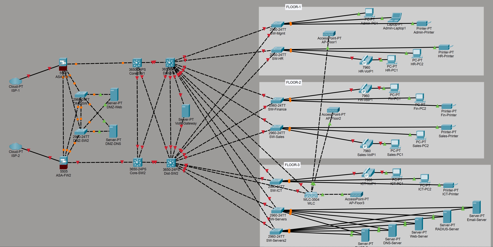

# AJ Industries — Enterprise Network Design
### Designed & Implemented in Cisco Packet Tracer



---

## Project Overview

This project presents a **fully redundant, enterprise-grade network** designed for AJ Industries — a multi-floor organisation requiring high availability, network segmentation, and robust cybersecurity controls.

The network was designed from scratch following **Cisco's three-tier hierarchical model** and incorporates real-world best practices used in Fortune 500 enterprise environments.

---

## Network Architecture

The network follows a **four-layer design**:

```
Internet (Dual ISP)
        │
┌───────┴───────┐
│  ASA Firewall │  ← Dual ASA 5505 (Active/Standby failover)
│     Layer     │
└───────┬───────┘
        │
   ┌────┴────┐
   │   DMZ   │  ← Redundant DMZ (dual switches, dual-homed servers)
   └────┬────┘
        │
┌───────┴───────┐
│  Core Layer   │  ← Dual Catalyst 3650 (fully meshed)
└───────┬───────┘
        │
┌───────┴───────┐
│ Distribution  │  ← Dual Catalyst 3650 (HSRP Active/Standby)
│    Layer      │
└───────┬───────┘
        │
┌───────┴────────────────────────────┐
│           Access Layer             │
│  Floor 1 │ Floor 2 │ Floor 3       │
└──────────┴─────────┴───────────────┘
```

---

## Devices Used

| Device | Model | Quantity | Role |
|--------|-------|----------|------|
| ISP Simulation | Cloud-PT | 2 | Dual internet uplinks |
| Firewall | Cisco ASA 5505 | 2 | Perimeter security, NAT, ACLs |
| DMZ Switch | Catalyst 2960 | 2 | Redundant DMZ switching |
| Core Switch | Catalyst 3650 | 2 | Core Layer 3 routing |
| Distribution Switch | Catalyst 3650 | 2 | Inter-VLAN routing, HSRP |
| Access Switch | Catalyst 2960 | 6 | Department access |
| Server Switch | Catalyst 2960 | 2 | Redundant server farm |
| Wireless Controller | Cisco WLC 3504 | 1 | Centralised WiFi management |
| Access Point | AccessPoint-PT | 3 | One per floor |
| IP Phone | Cisco 7960 | 4 | VoIP across all floors |
| Servers | Server-PT | 7 | DHCP, DNS, Web, RADIUS, Email |
| End Devices | PC-PT, Laptop-PT | 10 | Department workstations |
| Printers | Printer-PT | 4 | Department printers |

---

## VLAN Segmentation

| VLAN ID | Name | Subnet | Purpose |
|---------|------|--------|---------|
| 10 | Management | 192.168.10.0/24 | Network admin access |
| 20 | HR | 192.168.20.0/24 | Human Resources dept |
| 30 | Finance | 192.168.30.0/24 | Finance & Accounts dept |
| 40 | Sales | 192.168.40.0/24 | Sales & Marketing dept |
| 50 | ICT | 192.168.50.0/24 | IT department |
| 60 | WiFi | 192.168.60.0/24 | Wireless clients |
| 70 | VoIP | 192.168.70.0/24 | Voice traffic |
| 99 | Servers | 192.168.99.0/24 | Internal server farm |
| 199 | Blackhole | 192.168.199.0/24 | Unused ports |

---

## Redundancy & High Availability

AJ Industries has **zero single points of failure** at every layer:

| Layer | Redundancy Method | Failover Time |
|-------|------------------|---------------|
| Internet | Dual ISP | Seconds |
| Firewall | ASA Active/Standby failover | < 1 second |
| DMZ | Dual switches, dual-homed servers | Immediate |
| Core | Fully meshed dual switches + OSPF | < 3 seconds |
| Distribution | HSRP Active/Standby | < 3 seconds |
| Access | Dual uplinks to both distribution switches | < 1 second (RSTP) |
| Server Farm | Dual switches, critical servers dual-homed | Immediate |
| WiFi | WLC dual-homed to both distribution switches | Immediate |

---

## Routing Protocols

| Protocol | Where | Purpose |
|----------|-------|---------|
| OSPF | Core ↔ Distribution | Dynamic internal routing, automatic failover |
| HSRP | Distribution layer | Gateway redundancy for all VLANs |
| Rapid PVST+ | All switches | Loop prevention with fast convergence |
| Static routes | ASA Firewalls | Default route to ISP |

---

## Security Features

| Feature | Implementation | Purpose |
|---------|---------------|---------|
| Stateful Firewall | Dual ASA 5505 | Inspects all inbound/outbound connections |
| DMZ | Dual-switch DMZ zone | Isolates public servers from internal network |
| NAT | ASA Firewalls | Hides internal IP addressing |
| ACLs | ASA + Distribution switches | Controls inter-VLAN and perimeter traffic |
| VLAN Segmentation | 9 VLANs | Isolates departments — breach containment |
| Port Security | All access ports | Max 2 MACs per port — blocks rogue devices |
| BPDU Guard | All access ports | Prevents rogue switch attacks |
| PortFast | All access ports | Eliminates 30s STP delay for end devices |
| Blackhole VLAN 199 | All unused ports | Attackers plugging into empty ports get nothing |
| DHCP Snooping | Distribution layer | Prevents rogue DHCP server attacks |
| Dynamic ARP Inspection | Distribution layer | Prevents ARP spoofing/poisoning attacks |
| SSH Only | All devices | Encrypted management — Telnet completely disabled |
| RADIUS Authentication | Server farm | Centralised user authentication |
| 802.1X | WiFi (WLC 3504) | Enterprise wireless authentication |
| Management VLAN 10 | Dedicated VLAN | Out-of-band network management |

---

## Floor Layout

### Floor 1 — Management & HR
- SW-Mgmt (VLAN 10) — Admin workstations, laptop, printer
- SW-HR (VLAN 20) — HR PCs, VoIP phone, printer
- AP-Floor1 — WiFi coverage (VLAN 60)

### Floor 2 — Finance & Sales
- SW-Finance (VLAN 30) — Finance PCs, VoIP phone, printer
- SW-Sales (VLAN 40) — Sales PCs, VoIP phone, printer
- AP-Floor2 — WiFi coverage (VLAN 60)

### Floor 3 — ICT & Server Farm
- SW-ICT (VLAN 50) — IT PCs, VoIP phone, printer, laptop
- SW-Servers + SW-Servers2 (VLAN 99) — Redundant server farm
- WLC-3504 — Centralised wireless management
- AP-Floor3 — WiFi coverage (VLAN 60)

---

## DMZ Architecture

```
ASA-FW1 ──┐         ┌── DMZ-Web (dual-homed)
           ├─ DMZ-SW1┤
ASA-FW1 ──┘    │    └── DMZ-DNS (dual-homed)
               │
ASA-FW2 ──┐    │    ┌── DMZ-Web (dual-homed)
           ├─ DMZ-SW2┤
ASA-FW2 ──┘         └── DMZ-DNS (dual-homed)
```

Both firewalls connect to both DMZ switches. Both servers are dual-homed to both switches. No single point of failure exists in the DMZ.

---

## Key Design Decisions

**Why no traditional routers?**
Modern Catalyst 3650 Layer 3 switches perform all routing functions at wire speed — significantly faster than traditional routers. They support OSPF, BGP, ACLs, and NAT while providing the port density required for full mesh redundancy. This follows Cisco's recommended campus network design for organisations of this scale.

**Why dual ISPs?**
Business continuity requirement — AJ Industries cannot afford internet downtime. Dual ISPs with ASA failover ensures internet connectivity survives any single ISP outage.

**Why OSPF over EIGRP?**
OSPF is an open standard protocol — vendor agnostic and industry standard. EIGRP is Cisco proprietary. OSPF ensures the network remains flexible for future hardware changes while providing identical performance characteristics.

**Why HSRP over VRRP?**
AJ Industries runs an all-Cisco environment. HSRP provides tighter integration with Cisco hardware and supports preemption — allowing the primary gateway to reclaim Active status automatically after recovery.

---

## How to Open This Project

1. Download and install [Cisco Packet Tracer](https://www.netacad.com/courses/packet-tracer)
2. Clone this repository: `git clone https://github.com/YOUR-USERNAME/AJ-Industries-Enterprise-Network`
3. Open `AJ-Industries-Network.pkt` in Cisco Packet Tracer
4. Use Simulation mode to observe traffic flow between devices

---

## Skills Demonstrated

- Enterprise network design and architecture
- Cisco IOS configuration (switches and firewalls)
- Network security implementation
- Redundancy and high availability design
- VLAN design and inter-VLAN routing
- Wireless network design (WLC + 802.1X)
- VoIP network integration
- DMZ architecture and firewall configuration
- Routing protocol implementation (OSPF, HSRP)
- Spanning Tree Protocol (Rapid PVST+)
- Network documentation

---

## Author

**AJ** — Aspiring Cybersecurity Professional

*Designed as part of a Masters in Cybersecurity application portfolio*

---

*Built with Cisco Packet Tracer 8.x*
